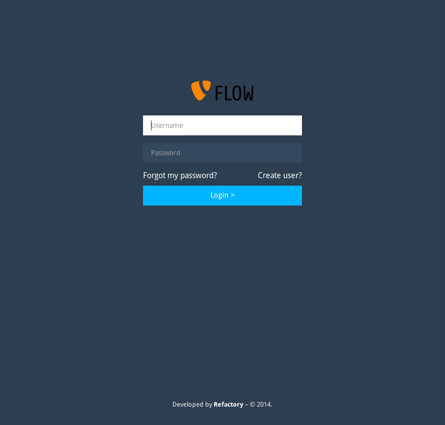
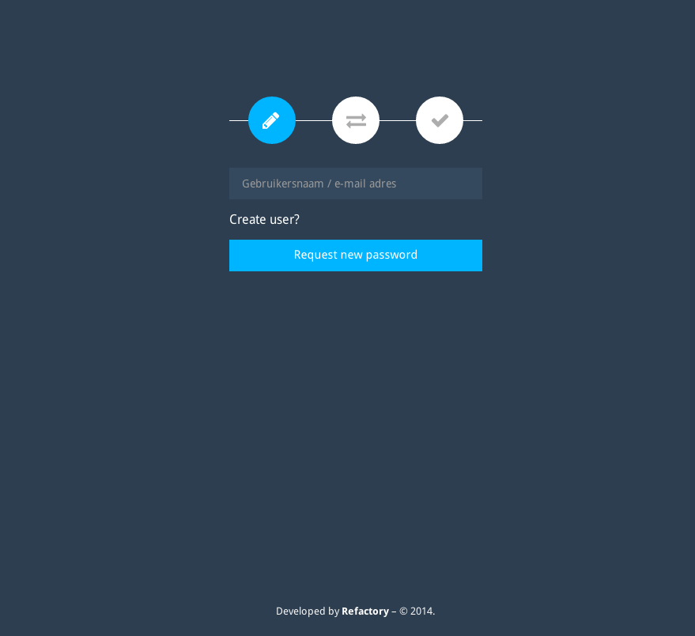

Refactory.Login 
==================================================================================================================================================================

This package is a lightweight authentication wrapper around a given package.
A TYPO3 Flow package with the following features:

 - Register User
 - Login and Logout a account
 - Reset a password for a given account.

These features have their own workflows, based on some research the idea was to make the registration as basic as possible.
The package is built on the features that are provided in the security framework of TYPO3.Flow and require only a little configuration.

Usage:
- Security layer for any application
- Inspiration

Quickstart
----------

To incluse this package into your TYPO3 Flow application just run:

	composer require refactory/login

Then you need to run migrations to include the tables.

	./flow doctrine:migrate

To Enable routing to package

	-
	  name: 'Login'
	  uriPattern: '<LoginSubroutes>'
	  subRoutes:
	    LoginSubroutes:
	      package: Refactory.Login

Start using!

Overview
--------

Authentication setup
--------------------

The initial view will show a login panel.

When authenticated but not configured, the package will redirect to the Signed In page by default.
The Signed In view will show you with what "account.identifier" you have been authenticated.

Through *Configuration/Settings.yaml* you will be able to configure options like redirects to a package, registration and so on.

#####Routing

To be able to address the login feature you will need to add these routes in the general Configuration/Routes.yaml

	-
	  name: 'Login'
	  uriPattern: '<LoginSubroutes>'
	  subRoutes:
	    LoginSubroutes:
	      package: Refactory.Login

Register User
-------------

*Note that when you register a user in the frontend you will NOT create an account! This will need to be done by your application.*

Because in most cases you do not want to directly create an account but want to control what will happen this is the default behaviour.
Through AOP you can adjust this behaviour to your needs.

Account ViewHelper
------------------

Add the viewhelper to fluid and call the viewhelper function.

	{namespace secure=Refactory\Login\ViewHelpers}

	<secure:account propertyPath="party.name" />

Redirect to Login page
----------------------

When the action is unauthorized the TYPO3.Flow framework will redirect the package to a location set with the Settings.yaml configuration.

	TYPO3:
	  Flow:
	    security:
	      authentication:
	        providers:
	          DefaultProvider:
	            entryPoint: 'WebRedirect'
	            entryPointOptions:
	              routeValues:
	                '@package': 'Refactory.Login'
	                '@controller': 'Login'
	                '@action': 'login'

See for reference: http://flow.typo3.org/documentation/guide/partiii/security.html
